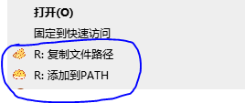

# Windows right click menu tools
Windows 下的右键菜单工具

#### 一、复制文件路径
    把选中的文件或文件夹的全路径复制到剪贴板。

#### 二、添加到PATH
    把选中的文件夹添加到环境变量 PATH 中，或从 PATH 中删除该文件夹。

### 安装及卸载
    以管理员模式打开 Powershell, 运行 install.bat 以安装, 运行 uninstall.bat 以卸载。